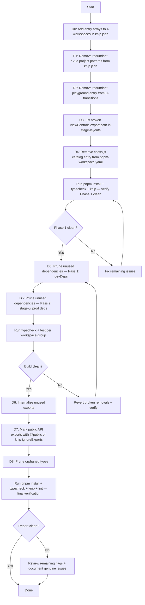

# Knip Cleanup Extended — Design

## Approach

This spec extends the existing [`knip-cleanup`](.roo/specs/knip-cleanup/design.md) work. Phase 1 and most of Phase 2 from that spec are complete; 4 carry-over tasks (adding `entry` arrays) remain. This design covers those carry-over tasks plus three new phases: configuration refinements, dependency pruning, and export cleanup.

Each change area targets a specific file or configuration with minimal, surgical edits. No refactoring or feature changes are involved.

## Change Areas

### D0: Add Entry Arrays to 4 Workspaces (Carry-Over from Existing Spec)

**Target file:** [`knip.json`](knip.json)

**Strategy:** Four workspace configurations lack `entry` arrays, causing Knip to flag every exported symbol as potentially unused. Add `"entry": ["src/index.ts"]` to each.

**Changes:**

| Workspace | Current Config | Change |
|-----------|---------------|--------|
| `packages/plugin-sdk` | `project` only + negation | Add `"entry": ["src/index.ts"]` |
| `packages/core-agent` | `project` only | Add `"entry": ["src/index.ts"]` |
| `packages/stage-ui-three` | `project` only | Add `"entry": ["src/index.ts"]` |
| `packages/ccc` | `project` only | Add `"entry": ["src/index.ts"]` |

**Resulting `packages/plugin-sdk` config:**

```json
"packages/plugin-sdk": {
  "entry": ["src/index.ts"],
  "project": [
    "src/**/*.ts",
    "!src/**/testdata/**"
  ]
}
```

**Resulting `packages/core-agent` config:**

```json
"packages/core-agent": {
  "entry": ["src/index.ts"],
  "project": [
    "src/**/*.ts"
  ]
}
```

**Resulting `packages/stage-ui-three` config:**

```json
"packages/stage-ui-three": {
  "entry": ["src/index.ts"],
  "project": [
    "src/**/*.ts"
  ]
}
```

**Resulting `packages/ccc` config:**

```json
"packages/ccc": {
  "entry": ["src/index.ts"],
  "project": [
    "src/**/*.ts"
  ]
}
```

**Rationale:** [`packages/plugin-sdk/src/index.ts`](packages/plugin-sdk/src/index.ts) re-exports plugin contracts and channels. [`packages/core-agent/src/index.ts`](packages/core-agent/src/index.ts) re-exports agent context types and hook types. [`packages/stage-ui-three/src/index.ts`](packages/stage-ui-three/src/index.ts) exports the `ThreeScene` component. [`packages/ccc/src/index.ts`](packages/ccc/src/index.ts) re-exports from `define` and `export` barrels. Without `entry`, Knip has no anchor to trace the public API surface.

---

### D1: Remove Redundant `*.vue` Project Patterns from knip.json

**Target file:** [`knip.json`](knip.json)

**Strategy:** Knip warns that `.vue` files are already registered via compiler configurations. The `"src/**/*.vue"` patterns in 6 workspace `project` arrays are redundant. Remove them, leaving only `"src/**/*.ts"` (and any negation patterns).

**Changes:**

| Workspace | Before | After |
|-----------|--------|-------|
| `apps/stage-tamagotchi` | `["src/**/*.ts", "src/**/*.vue"]` | `["src/**/*.ts"]` |
| `packages/stage-ui` | `["src/**/*.ts", "src/**/*.vue"]` | `["src/**/*.ts"]` |
| `packages/ui-transitions` | `["src/**/*.ts", "src/**/*.vue", "playground/src/**/*.ts"]` | `["src/**/*.ts", "playground/src/**/*.ts"]` |
| `packages/stage-ui-three` | `["src/**/*.ts", "src/**/*.vue"]` | `["src/**/*.ts"]` |
| `packages/stage-ui-live2d` | `["src/**/*.ts", "src/**/*.vue"]` | `["src/**/*.ts"]` |
| `packages/stage-layouts` | `["src/**/*.ts", "src/**/*.vue"]` | `["src/**/*.ts"]` |

**Rationale:** Knip's compiler configuration already handles `.vue` file resolution. Explicit `*.vue` glob patterns in `project` are redundant and produce warnings. Removing them silences the warnings without affecting analysis accuracy.

---

### D2: Remove Redundant Entry Point from ui-transitions

**Target file:** [`knip.json`](knip.json)

**Strategy:** The `packages/ui-transitions` workspace has `"playground/src/main.ts"` in its `entry` array. Knip flagged this as redundant because the playground is a development tool, not part of the library's public API surface.

**Change:** Remove the entire `entry` array from the `packages/ui-transitions` workspace configuration.

**Before:**

```json
"packages/ui-transitions": {
  "entry": [
    "playground/src/main.ts"
  ],
  "project": [
    "src/**/*.ts",
    "playground/src/**/*.ts"
  ]
}
```

**After:**

```json
"packages/ui-transitions": {
  "project": [
    "src/**/*.ts",
    "playground/src/**/*.ts"
  ]
}
```

**Rationale:** The playground entry point is not part of the package's public API. Knip can trace the library's actual exports from the `package.json` `exports` field. The playground files are covered by the `project` pattern for completeness but should not be treated as entry points.

---

### D3: Fix Broken Export Path in stage-layouts/package.json

**Target file:** [`packages/stage-layouts/package.json`](packages/stage-layouts/package.json:22)

**Strategy:** The export path `"./components/Layouts/ViewControls/*": "./src/components/Layouts/ViewControls/*.vue"` points to a non-existent directory. The actual [`ViewControls.vue`](packages/stage-layouts/src/components/Layouts/InteractiveArea/Actions/ViewControls.vue) lives under `InteractiveArea/Actions/`. The component is already reachable via the existing `"./components/Layouts/InteractiveArea/Actions/*"` export at [line 21](packages/stage-layouts/package.json:21).

**Change:** Remove line 22 from the `exports` section.

**Before:**

```json
"exports": {
  ".": "./src/index.ts",
  "./layouts/*": "./src/layouts/*.vue",
  "./components/Layouts/*": "./src/components/Layouts/*.vue",
  "./components/Layouts/InteractiveArea/Actions/*": "./src/components/Layouts/InteractiveArea/Actions/*.vue",
  "./components/Layouts/ViewControls/*": "./src/components/Layouts/ViewControls/*.vue",
  "./components/Widgets/*": "./src/components/Widgets/*.vue",
  "./components/Backgrounds/*": "./src/components/Backgrounds/*",
  "./composables/*": "./src/composables/*.ts",
  "./stores/*": "./src/stores/*.ts"
}
```

**After:**

```json
"exports": {
  ".": "./src/index.ts",
  "./layouts/*": "./src/layouts/*.vue",
  "./components/Layouts/*": "./src/components/Layouts/*.vue",
  "./components/Layouts/InteractiveArea/Actions/*": "./src/components/Layouts/InteractiveArea/Actions/*.vue",
  "./components/Widgets/*": "./src/components/Widgets/*.vue",
  "./components/Backgrounds/*": "./src/components/Backgrounds/*",
  "./composables/*": "./src/composables/*.ts",
  "./stores/*": "./src/stores/*.ts"
}
```

**Rationale:** The broken path resolves to nothing — no `ViewControls/` directory exists. `ViewControls.vue` is already covered by the `InteractiveArea/Actions/*` wildcard. Removing the broken entry prevents resolution errors and cleans the package manifest.

---

### D4: Remove Unused chess.js Catalog Entry

**Target file:** [`pnpm-workspace.yaml`](pnpm-workspace.yaml:49)

**Strategy:** The `chess.js: ^1.4.0` catalog entry is orphaned — `chess.js` was removed from [`apps/stage-tamagotchi/package.json`](apps/stage-tamagotchi/package.json) during the original Phase 1 cleanup, and no other workspace references it.

**Change:** Remove line 49 (`chess.js: ^1.4.0`) from the `catalog` section.

**Rationale:** Orphaned catalog entries create confusion and may cause `pnpm install` to resolve unnecessary packages. Since `catalogMode: prefer` is set at [line 92](pnpm-workspace.yaml:92), pnpm will try to use catalog versions when available — an orphaned entry could accidentally satisfy a future dependency request.

---

### D5: Prune Unused Dependencies — Incremental Approach

**Strategy:** Remove unused dependencies in two passes to minimize risk of build breakage:

1. **Pass 1 — Root/Dev Dependencies:** Remove verified unused devDependencies first. These are typically build tooling, type definitions, and icon packs that are no longer imported. Removing devDependencies has lower risk since they don't affect production bundles.

2. **Pass 2 — Package-Level Production Dependencies:** Remove unused production dependencies per workspace, grouped by risk level. After each group, run typecheck + build to verify no breakage.

**High-confidence removals for `packages/stage-ui`:**

The following 13 packages in [`packages/stage-ui/package.json`](packages/stage-ui/package.json) have zero imports in the `src/` tree:

| Package | Line | Removal Command |
|---------|------|-----------------|
| `@proj-airi/audio` | 74 | Part of bulk remove |
| `@proj-airi/core-character` | 78 | Part of bulk remove |
| `@proj-airi/font-chillroundm` | 80 | Part of bulk remove |
| `@ricky0123/vad-web` | 93 | Part of bulk remove |
| `@shopify/draggable` | 95 | Part of bulk remove |
| `d3` | 117 | Part of bulk remove |
| `embla-carousel-autoplay` | 120 | Part of bulk remove |
| `gpuu` | 123 | Part of bulk remove |
| `hono` | 124 | Part of bulk remove |
| `rehype-parse` | 136 | Part of bulk remove |
| `splitpanes` | 143 | Part of bulk remove |
| `unist-builder` | 145 | Part of bulk remove |
| `unist-util-visit` | 146 | Part of bulk remove |

**Single command:**

```bash
pnpm --filter @proj-airi/stage-ui remove @proj-airi/audio @proj-airi/core-character @proj-airi/font-chillroundm @ricky0123/vad-web @shopify/draggable d3 embla-carousel-autoplay gpuu hono rehype-parse splitpanes unist-builder unist-util-visit
```

**Associated type packages to remove from devDependencies:**

| Package | Reason |
|---------|--------|
| `@types/d3` | `d3` is being removed |
| `@types/splitpanes` | `splitpanes` is being removed |
| `@types/unist` | `unist-util-visit` and `unist-builder` are being removed |

```bash
pnpm --filter @proj-airi/stage-ui remove @types/d3 @types/splitpanes @types/unist
```

**Verification after stage-ui pruning:**

```bash
pnpm -F @proj-airi/stage-ui typecheck
pnpm -F @proj-airi/stage-ui test:run
```

**Note on remaining 75 unused dependencies + 66 devDependencies:** A full Knip run should be executed before implementation to extract the complete list. The implementer should group removals by workspace and verify after each group. Some dependencies may be implicitly used by Vite plugins or bundler config and should be verified before removal.

---

### D6: Internalize Unused Exports

**Strategy:** For each unused export that is only consumed within its own declaring file, remove the `export` keyword. This is a surgical, file-level change that does not affect inter-module dependencies.

**Example — [`prepareVrmOutlineRuntime`](packages/stage-ui-three/src/composables/vrm/outline.ts:464):**

The function is exported at line 464 but only called internally at line 497 within [`createVrmOutlineHook`](packages/stage-ui-three/src/composables/vrm/outline.ts:491). Remove `export`:

```ts
// Before:
export function prepareVrmOutlineRuntime(vrm: VRM) { ... }

// After:
function prepareVrmOutlineRuntime(vrm: VRM) { ... }
```

Similarly, [`disposeVrmOutlineRuntime`](packages/stage-ui-three/src/composables/vrm/outline.ts:484) is exported but only called internally within the same file's `onDispose` hook. Remove `export` from it as well.

**Process for all 58 unused exports:**

1. Run `pnpm knip` to get the current list of unused exports
2. For each export, verify it has zero external imports using `search_files`
3. If zero external imports found, remove the `export` keyword
4. If external imports exist, the Knip flag may be a false positive — skip and document

---

### D7: Retain Public API Exports

**Strategy:** Some unused exports are intentionally kept as part of a public SDK/API surface. These should not be removed but instead documented to prevent future Knip flags.

**Workspaces with public API intent:**

| Workspace | Reason to Retain |
|-----------|-----------------|
| `packages/plugin-sdk` | Public plugin development SDK — exports are intended for external consumers |
| `packages/core-agent` | Public agent contract types — intended for cross-package use |

**Approach:** Add `@public` JSDoc tags to retained exports, or add them to [`knip.json`](knip.json) `ignoreExports` configuration:

```json
"ignoreExports": [
  "packages/plugin-sdk/src/**",
  "packages/core-agent/src/**"
]
```

**Rationale:** Public SDK packages should export their full contract surface even if no current consumer exists. Knip flags are false positives for these cases.

---

### D8: Prune Orphaned Types

**Strategy:** Remove 112 unused exported types/interfaces that have zero import references across the monorepo. Since types are erased at compile time, removal has no runtime impact.

**Process:**

1. Run `pnpm knip` to extract the full list of 112 unused types
2. For each type, verify zero import references using `search_files`
3. Check that the type is not:
   - Referenced in Vue template type inference (e.g., used as a prop type without explicit import)
   - Used as a generic parameter constraint in an otherwise-used type
   - Part of a planned public API surface (per D7)
4. Remove the type declaration and any associated JSDoc
5. If the type was the only export in a file, consider deleting the entire file

**Rationale:** Unused exported types add noise to the codebase and broaden the public API surface unintentionally. Removing them improves code clarity and reduces Knip flag count.

---

## Flow Diagram



## Risk Assessment

| Risk | Mitigation |
|------|------------|
| Removing `*.vue` from project patterns causes Knip to miss Vue files | Knip's compiler config already handles `.vue` — this is confirmed by Knip's own warning message |
| Removing `playground/src/main.ts` entry causes Knip to flag playground files | Playground is a dev tool, not public API; `project` pattern still covers the files for analysis |
| Removing broken ViewControls export breaks existing consumers | No `ViewControls/` directory exists — the export already resolves to nothing. The component is reachable via `InteractiveArea/Actions/*` |
| Removing `chess.js` catalog entry breaks a workspace that uses it | `chess.js` was already removed from all package.json files in Phase 1; no workspace references it |
| Bulk dependency removal causes build failures | Incremental approach: remove per workspace group, verify with typecheck + test after each group |
| Removing `export` from internally-used functions breaks external consumers | Each export is verified with `search_files` for zero external imports before removal |
| Removing orphaned types breaks Vue template type inference | Each type is checked for implicit Vue prop usage before removal |
| Public SDK exports are incorrectly removed | D7 explicitly retains plugin-sdk and core-agent exports with `@public` tags or Knip ignore rules |